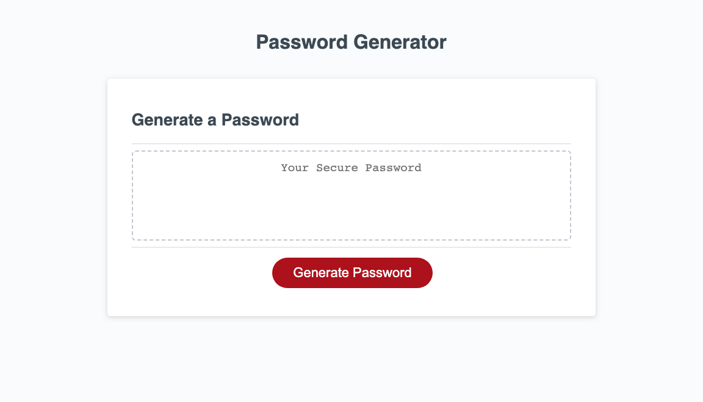

# 03-JavaScript-Password-Generator

## Description
The Password Generator builds complex passwords on demand.

#### Passwords Rules:
1. Minimum Length: 8 characters
2. Maximum Length: 128 Characters
3. Passwords can contain:
    * lower case characters
    * upper case charcaters
    * numbers
    * special characters
    * At least 1 character set must be used

## Password Generator Website Link
Click the link to visit the deployed wbsite: [Password Generator][def1].

## Site Structure

## Navigation

## Password Generator Website
The Password Generator website looks like this:. 

## Refactoring Changes 

## Changelog
The development history is recorded in the [Changelog](./CHANGELOG.md).

## Resources Used
1. Bootcamp Materials - Lesson Material from Week 3
2. Prior knowlege and experience
3. [MDM Web Docs][def2] working with objects
4. [MDM Web Docs][def3] loops and iteration

[def1]: https://dingogap.github.io/03-JavaScript-Password-Generator/
[def2]: https://developer.mozilla.org/en-US/docs/Web/JavaScript/Guide/Working_with_objects
[def3]: https://developer.mozilla.org/en-US/docs/Web/JavaScript/Guide/Loops_and_iteration

