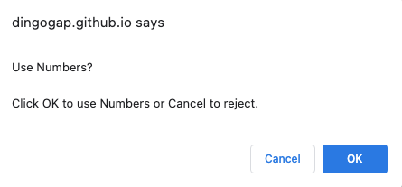
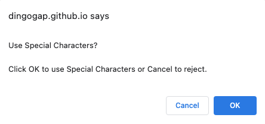

# 03-JavaScript-Password-Generator

## Description
The Password Generator builds complex passwords on demand.

#### Passwords Rules:
1. Minimum Length: 8 characters
2. Maximum Length: 128 Characters
3. Passwords can contain:
    * lower case characters
    * upper case charcaters
    * numbers
    * special characters
    * at least 1 character set must be used

    

## Password Generator Website Link
Click the link to visit the deployed wbsite: [Password Generator][def1].

## Site Structure

## Navigation

The Password Generator website looks like this:. 

Clicking the Generate Password Button starts collecting paramters the website needs to generate a password.

##### Prompt 1: Enter Password Length

If:
&nbsp;&nbsp;&nbsp;&nbsp;1. a valid password length is entered the process will continue.
&nbsp;&nbsp;&nbsp;&nbsp;2. cancel is clicked the proces will stop
&nbsp;&nbsp;&nbsp;&nbsp;3. OK (with an empty inout field) the process will stop
&nbsp;&nbsp;&nbsp;&nbsp;4. any other entry and the prompt will be presented again

#### Prompt 2: Check for Lowercase Characters

If:
&nbsp;&nbsp;&nbsp;&nbsp;1. Y or y is entered in this prompt then Lowercase Chacters will be included in password
&nbsp;&nbsp;&nbsp;&nbsp;2. Any other character is entered Lowercase Characters will not be included in the password

#### Prompt 3: Check for Uppercase Characters

If:
&nbsp;&nbsp;&nbsp;&nbsp;1. Y or y is entered in this prompt then Uppercase Chacters will be included in password
&nbsp;&nbsp;&nbsp;&nbsp;2. Any other character is entered Uppercase Characters will not be included in the password

#### Prompt 4: Check for Numbers

If:
&nbsp;&nbsp;&nbsp;&nbsp;1. Y or y is entered in this prompt then Numbers will be included in password
&nbsp;&nbsp;&nbsp;&nbsp;2. Any other character is entered Numbers will not be included in the password

#### Prompt 5: Check for Special Characters

If:
&nbsp;&nbsp;&nbsp;&nbsp;1. Y or y is entered in this prompt then Special Characters will be included in password
&nbsp;&nbsp;&nbsp;&nbsp;2. Any other character is entered Special Characters will not be included in the password

#### Error Message: No Character Sets Selected

If no Character Sets were chosen for the new password then this error message is displayed.

When OK is clicked the process to choose Caracter Sets for the password will be repeated.

#### Result
When all necessary data has been entered the website will generate a new password and it will be displayed like this: 

This a 25 character password using all Character Sets.

## Changelog
The development history is recorded in the [Changelog](./CHANGELOG.md).

## Resources Used
1. Bootcamp Materials - Lesson Material from Week 3
2. Prior knowlege and experience
3. [MDM Web Docs][def2] working with objects
4. [MDM Web Docs][def3] loops and iteration

[def1]: https://dingogap.github.io/03-JavaScript-Password-Generator/
[def2]: https://developer.mozilla.org/en-US/docs/Web/JavaScript/Guide/Working_with_objects
[def3]: https://developer.mozilla.org/en-US/docs/Web/JavaScript/Guide/Loops_and_iteration

